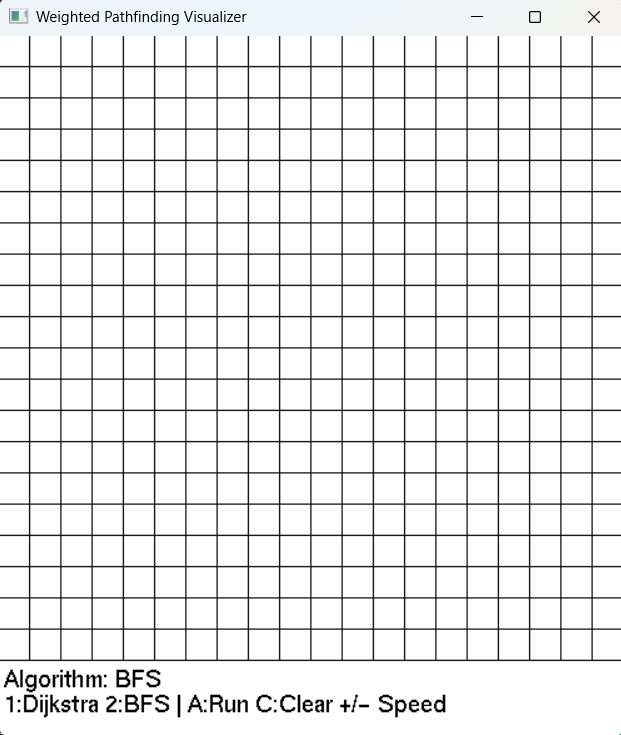
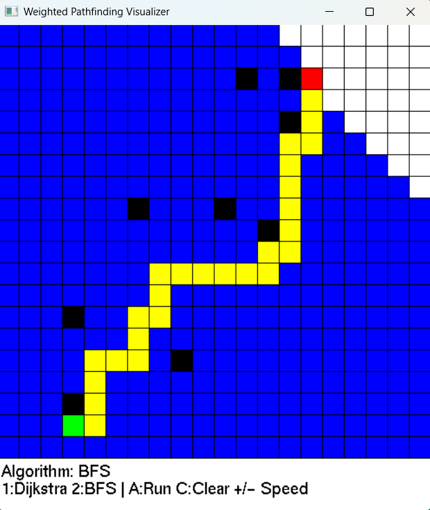
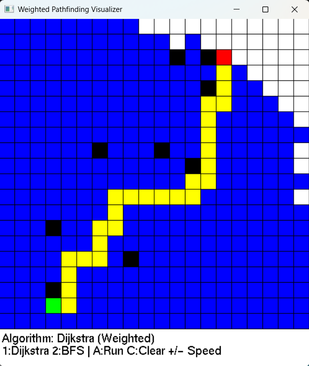

# 🚀 Weighted Pathfinding Visualizer

<p align="center">
  <strong>Real-Time Pathfinding Visualizer using C++, OpenGL, BFS, and Dijkstra on Weighted Grids</strong>
</p>

---

## 📌 Overview

This project is an interactive **pathfinding visualizer** built using **C++** and **OpenGL (GLUT)**.

It demonstrates how graph traversal and shortest-path algorithms work in real time on a weighted grid environment.

### Features:
- Select start and end nodes
- Create obstacles
- Visualize BFS and Dijkstra algorithms
- Observe node exploration step-by-step
- Highlight the final shortest path

---

## ✨ Features

- 🎮 Interactive grid-based UI
- 🟢 Start node selection
- 🔴 End node selection
- ⚫ Obstacle generation
- 🔵 Real-time visited-node animation
- 🟡 Final shortest-path highlighting
- ⚡ Adjustable animation speed
- 📊 Weighted graph implementation
- 🧠 BFS and Dijkstra visualization
- 🎨 OpenGL-based rendering

---

## 🛠 Tech Stack

| Technology | Purpose |
|------------|----------|
| **C++** | Core Programming Language |
| **OpenGL / GLUT** | Graphics Rendering |
| **STL** | Data Structures (`queue`, `priority_queue`) |
| **OOP** | Modular Class Design |

---

## 🧠 Algorithms Implemented

### 🔹 Breadth First Search (BFS)

- Uses `queue`
- Explores nodes level-by-level
- Suitable for unweighted traversal

### 🔹 Dijkstra’s Algorithm

- Uses `priority_queue`
- Computes shortest weighted path
- Handles varying traversal costs efficiently

---

## 🎮 Controls

| Key | Action |
|-----|--------|
| `1` | Select Dijkstra Algorithm |
| `2` | Select BFS Algorithm |
| `A` | Run Algorithm |
| `C` | Clear Grid |
| `+ / -` | Increase / Decrease Speed |
| `Mouse Click` | Set Start, End, and Obstacles |

---

## 🎨 Node Color Representation

| Color | Meaning |
|-------|---------|
| 🟢 Green | Start Node |
| 🔴 Red | End Node |
| ⚫ Black | Obstacle |
| 🔵 Blue | Visited Node |
| 🟡 Yellow | Final Path |
| ⚪ White | Unvisited Node |

---

# 🖼 Screenshots

## Grid Initialization



---

## BFS Visualization



---

## Dijkstra Visualization



---

## ⚙️ How to Run

### Windows (MinGW)

```bash
g++ src/main.cpp -o app -lfreeglut -lopengl32 -lglu32
./app
```

### Linux

```bash
g++ src/main.cpp -o app -lglut -lGL -lGLU
./app
```

---

## 📚 Concepts Used

- Graph Traversal
- Weighted Shortest Path
- Event-Driven Programming
- Real-Time Rendering
- Animation Loop
- Coordinate Mapping
- Path Reconstruction
- Object-Oriented Programming

---

## 📂 Project Structure

```text
AI-pathfinding-visualizer/
│
├── src/
│   └── main.cpp
│
├── screenshots/
│   ├── bfs.png
│   ├── dijkstra.png
│   └── grid.png
│
├── README.md
└── .gitignore
```

---

## 💡 Future Improvements

- A* Algorithm Support
- Drag-to-draw Obstacles
- Right-click Eraser
- GUI Controls
- Diagonal Movement
- Performance Statistics

---

## 🌟 Learning Outcomes

This project strengthened my understanding of:

- Data Structures & Algorithms
- Graph Theory
- OpenGL Rendering
- Event-Driven Programming
- Animation Systems
- Object-Oriented Design
- Git & GitHub Workflow

---

## 📬 Feedback

Suggestions and improvements are always welcome! 🚀
